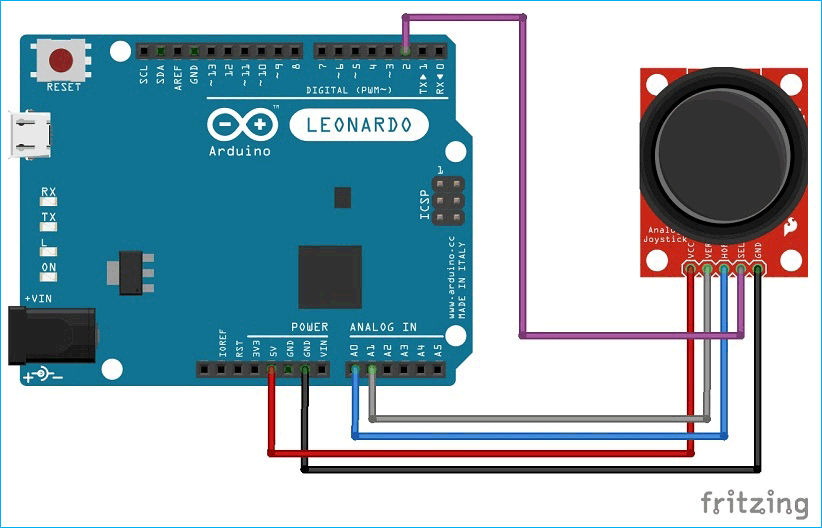

# Arduino Gesture and Joystick Control


## Overview

This repository contains the Arduino code and schematics for a versatile controller that combines joystick input and infrared (IR) gesture recognition. The project is designed to control a PC or laptop, allowing users to navigate videos, control games, and perform various tasks using hand gestures and joystick movements.

### Key Features

- **Joystick Control**: Utilize a joystick module to simulate keyboard inputs for precise control over video playback and games.
- **IR Gesture Recognition**: Four IR sensor modules detect hand gestures, enabling intuitive and touchless control.
- **Ultrasonic Sensor**: An HC-SR04 ultrasonic sensor limits IR gesture detection to a specific range, ensuring accuracy.
- **LED Feedback**: LEDs provide visual feedback, indicating the direction of joystick movements or recognized gestures.
- **Button Integration**: A small button facilitates additional actions, such as toggling between full screen and small screen mode.
- **Versatile Usage**: Ideal for controlling media playback, gaming, and other PC tasks.

## Components

- Joystick Module
- IR Sensor Modules (4)
- HC-SR04 Ultrasonic Sensor
- Breadboard
- Resistors (4 * 220 ohm, 1 * 10K ohm)
- Small Button
- LEDs (5)
- Female-to-Male Dupont Wires
- Jumper Wires
- Arduino Leonardo Board
- USB Cable (for Arduino-PC connection)

## Getting Started

1. Clone this repository to your local machine.

   ```bash
   git clone https://github.com/prgrmcode/Gesture-and-Joystick-Control_by_Arduino.git
   ```

2. Upload the Arduino sketch (Arduino_Code.ino) to your Arduino Leonardo board.



3. Connect the specified components as per the provided schematics.

4. Customize the code (Arduino_Code.ino) to suit your specific requirements.

5. Run the project and enjoy gesture and joystick control of your PC.

## License

This project is open-source under the [Apache-2.0 Licence](LICENSE). Feel free to modify and share it as needed.

## Contributions

Contributions and improvements are welcome. Please submit pull requests and report any issues or suggestions.

## Acknowledgments

- [Arduino](https://www.arduino.cc/) for the Arduino platform and libraries.
- Community contributions and online resources that helped develop this project.

## Author
Harun (GitHub: @prgrmcode)